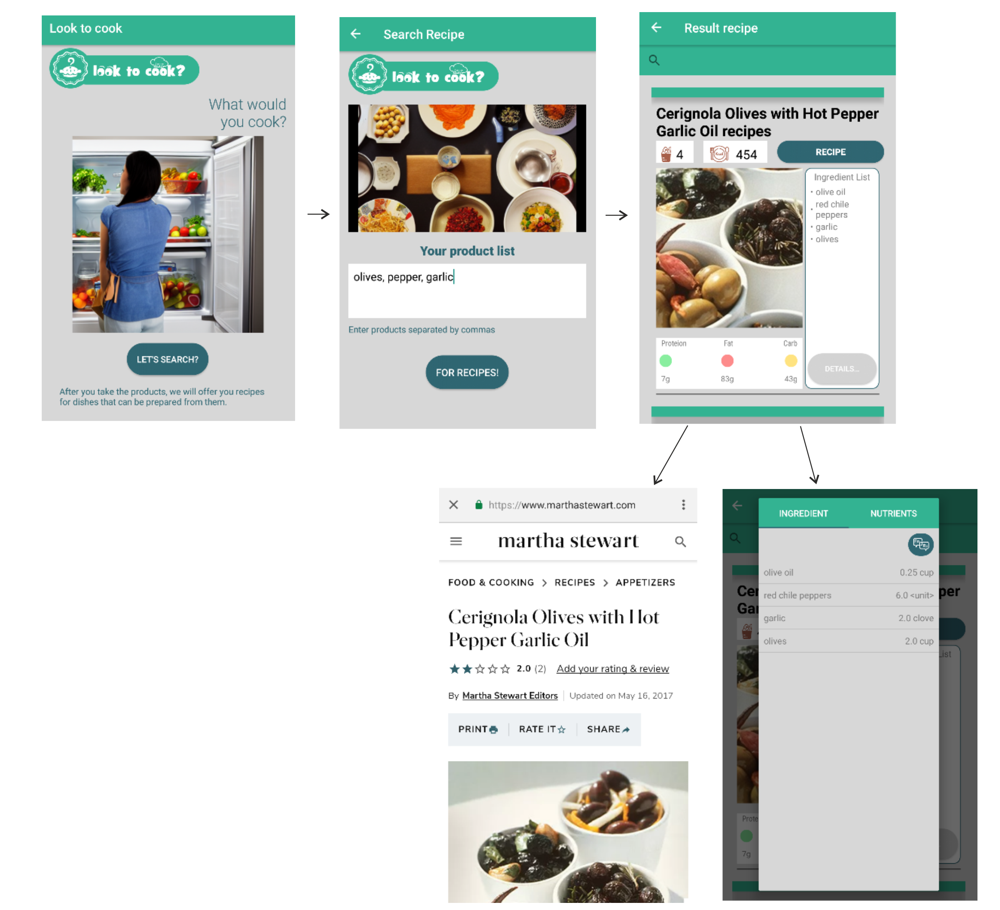

# Look to cook
## 👋

Hello! Have you ever opened the refrigerator with the thought of cooking? Have you looked at the products in it and puzzled over how to cook such of the available ingredients for a long time? If yes, then I understand you perfectly :) With this application, you can find a list of various dishes by entering only a list of products from which you want to cook something. Meal recipes will contain information about the ingredients and their doses, nutrients and a link with a more detailed description of the dish. I wish you happy cooking!^^
____
## App navigation

The application consists of 3 main screens::
1. Welcome screen
2. Ingredients Entry Screen
3. Screen showing found recipes

On the 3rd screen, it is possible to:
1. by clicking on the "Recipe" button, open a link with a detailed guide to cooking the corresponding dish.
2. by clicking on the "Details" button, a window opens with a detailed description of the ingredients and nutrients that are related to the recipe.

____
## Instructions for use
The instruction is quite simple. When launching the application and going to the Search Recipe screen, enter the ingredients you want to cook with, then press the "For Recipes!" button. In the window that opens, you can easily scroll through the list of found recipes and choose the most delicious recipe for you based on the number of servings, kcal, number of nutrients, or maybe even because of the picture ^^. After choosing the recipe you like, click on the "Recipe" button to study the cooking method on a more specialized resource.
For your convenience, if you suddenly do not understand the list of ingredients, you can go to the screen with a more detailed description of them by clicking on the "Details" button, then click on the translate button in the upper right corner. A translator will open in front of you, into which you can simply paste the list of recipe ingredients, which will be copied automatically.
_____
## List of technologies
1. Development language: kotlin
2. Design pattern: MVVM + Single Activity
3. DI: Dagger2
4. Navigation: Jetpack Navigation
5. Asynchrony: Coroutine
6. Networking: Retrofit2
7. API Search Recipe: https://developer.edamam.com/edamam-docs-recipe-api-v1
8. API Translate Words: https://mymemory.translated.net/doc/spec.php
9. Download Image: Glide
10. Open URL Recipe: Chrome Custom Tabs

## Privacy policy
To read the app's privacy policy, click <a href="privacy_policy.html">here</a>.
